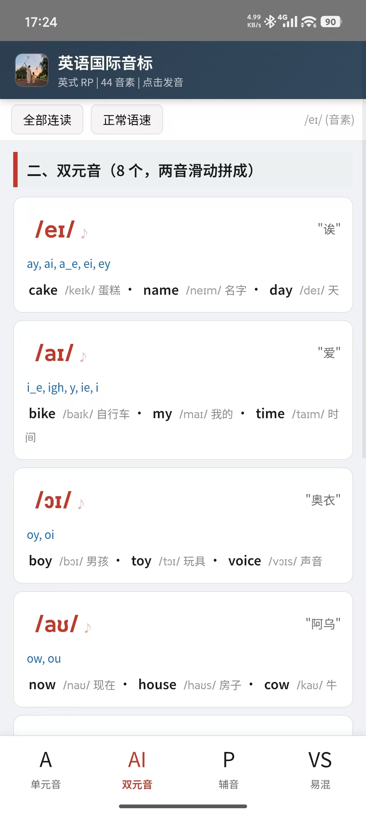
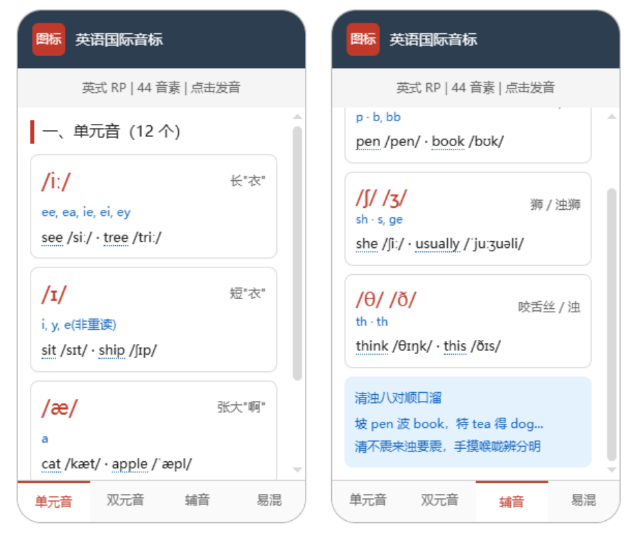

# 英语国际音标互动学习 APP

一个离线可用的英语国际音标学习工具，包含 44 个音素的真人录音、82 个示例单词发音、常见字母组合标注和顺口溜记忆法。

## ✨ 功能特性

- **44 个音素**点击即播放真人录音（英式 RP 发音，与教材同款）
- **每个音素标注**常见字母组合（如 `/iː/` → ee, ea, ie）
- **82 个示例单词**含中文释义，点击播放单词发音
- **易混音素对比**一键播放（如 sheep vs ship、think vs sink）
- **四章节卡片布局**：单元音(12) · 双元音(8) · 辅音(24) · 易混对比(5对)
- **完全离线**，所有音频打包在内，无需网络

## 📸 应用截图

| 双元音与底部章节导航 | 单元音与辅音（含顺口溜） |
|---|---|
|  |  |

## 🔗 在线试用

网页版（GitHub Pages）：

https://anliannideshui.github.io/english-phonetic-chart/

> 手机/电脑浏览器直接打开即可使用，首次加载需联网下载音频，之后浏览器会缓存。

## 📱 安卓 APK

本项目已打包为安卓 APK 安装包（离线版，含 44 音素真人录音 + 82 单词发音，完全离线）。

📥 **下载最新版 v1.1**：[GitHub Releases](https://github.com/anliannideshui/english-phonetic-chart/releases)

> 在 Releases 页下载 `english-phonetic-chart-v1.1.apk`，安装到安卓手机即可离线使用。

## 📁 目录结构

```
english-phonetic-chart/
├── docs/                  # 网页版（GitHub Pages 源，正式版）
├── android/               # Capacitor Android 项目（打包 APK 用）
├── audio/                 # 原始音素音频（abelard.org 英式 RP）
├── android-icons/         # 应用图标各尺寸
├── gen_word_audio.py      # 用 edge-tts 生成单词音频的脚本
├── gen_icons.py           # 图标生成脚本
├── capacitor.config.json  # Capacitor 配置
└── package.json
```

## 🛠 技术栈

- **前端**：纯 HTML / CSS / JavaScript
- **音频播放**：Web Audio API + 预生成 MP3（不依赖浏览器 TTS）
- **移动端打包**：Capacitor 6 + Android SDK 34 + OpenJDK 17

## 📝 本地运行（网页版）

直接用浏览器打开 `docs/index.html` 即可使用全部功能。

## 📦 打包 APK

```bash
# 1. 安装依赖
npm install

# 2. 同步网页资源到 Android 项目
npx cap sync android

# 3. 构建 Debug APK
cd android
./gradlew assembleDebug

# 生成的 APK: android/app/build/outputs/apk/debug/app-debug.apk
```

## 🎵 音频来源与版权

| 内容 | 来源 | 许可 |
|------|------|------|
| 44 个音素录音 | abelard.org（英式 RP） | 免费用于教育 |
| 82 个单词发音 | Microsoft Edge TTS（en-GB-SoniaNeural） | 合理使用 |

音频素材版权归原作者所有，本项目仅用于英语学习用途。

## ⚠️ 声明

**本项目由 AI 独立完成。作者只提供思路。作者不为本项目及其衍生产品负责。**

## 📄 许可证

代码以 MIT 许可证开源。音频素材版权归各自原作者所有。
